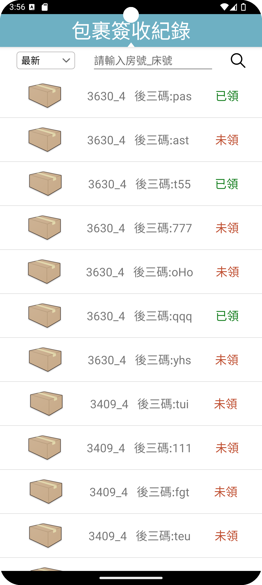

# Dormitory Equipment Monitoring App

## Introduction
This is a Kotlin-based mobile app project designed to address the issue of students in campus dormitories being unable to timely check the usage status of public equipment (such as washing machines), which may lead to unnecessary trips. The primary purpose of this application is to integrate with Raspberry Pi to monitor the status of public equipment. Additionally, it includes other functionalities such as garbage truck reminders, parcel pickup notifications, and equipment repair requests. This app has two user interfaces: one for students and one for administrators, aiming to improve both the usage experience of dormitory facilities for students and the management efficiency for administrators.

## Features
- Real-time monitoring of public equipment status
- Garbage truck arrival reminders
- Parcel pickup notifications
- Equipment repair request system
- Separate interfaces for students and administrators

## Screenshots
Main page

Students page

Admin page

Admin Package record

## Data Flow Diagram
